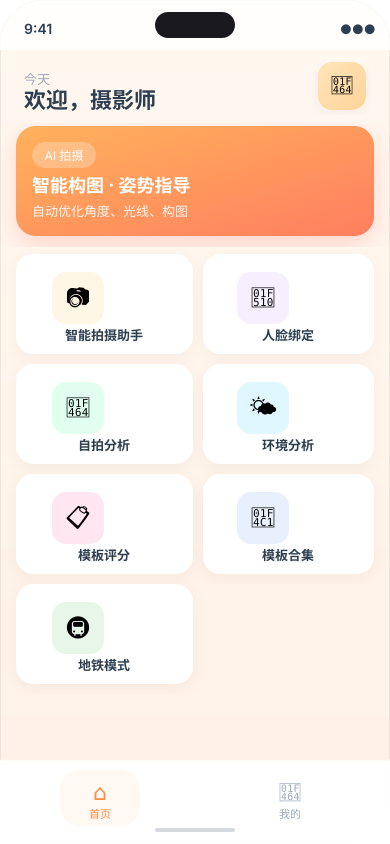
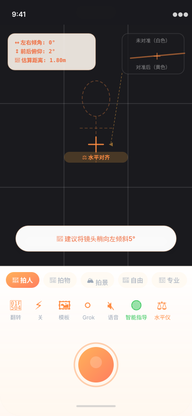

<div align="center">

<h1>万能拍 · AI Camera</h1>

<p>
  <strong>基于 OpenCV 透明线稿重叠的移动端摄影智能引导平台</strong>
</p>

<p>
  <a href="#核心功能"></a>
  <a href="#技术栈"></a>
  <a href="#技术栈"></a>
  <a href="#技术栈"></a>
  
</p>

</div>

---

## 项目简介

**万能拍**是一个专注于摄影引导的移动端全栈应用，核心创新在于将 OpenCV 生成的**透明线稿实时叠加**在相机取景框之上，为用户提供直觉式的构图参考。

区别于静态的拍摄教程，本平台通过多模型 AI 链路（PaliGemma → Qwen → Grok）对相机画面进行实时分析，结合陀螺仪传感器数据，以悬浮气泡、骨骼追踪、水平仪等可视化手段，将专业摄影构图知识即时转化为可执行的动作指令。

---

## 核心功能展示

<table>
  <tr>
    <td align="center" width="50%">
      
      <br/>
      <sub><b>首页 · 功能导航</b></sub>
    </td>
    <td align="center" width="50%">
      
      <br/>
      <sub><b>相机页 · AI 构图引导 + 水平仪</b></sub>
    </td>
  </tr>
</table>

> **水平仪说明**：取景框居中显示一条动态指示线——设备倾斜时呈**橙白色**，手机达到水平对齐后自动变为**黄橙色渐变并触发振动反馈**，实现零视线转移的水平校准。

---

## 特性列表

### 拍摄辅助
- **透明线稿叠加**：上传参考图片，后端经 OpenCV 提取轮廓后生成 RGBA 线稿，以 40% 透明度覆盖取景框，作为实时构图引导层
- **水平仪**：三轴加速度计低通滤波 + 磁吸吸附（±3.5° 容差），水平时自动振动并切换配色
- **九宫格 / 细分网格**：可切换的构图辅助线叠加层
- **预设辅助框**：人像（椭圆）、美食、风景三种构图模板框

### AI 智能指导
- **智能模式（人像 / 静物 / 风光）**：每 5 秒抓帧上传，AI 返回构图建议与目标距离；构图完美时自动触发抓拍并高亮绿色边框
- **Grok 视觉分析**：接入 xAI Grok API 进行场景理解，给出摄影师视角的创作建议
- **语音播报**：调用百度 TTS 将 AI 建议转为语音，免手持操作

### 专业模式（三段流水线）
1. **PaliGemma**（本地 3B 视觉模型）：场景描述与构图感知
2. **Qwen 视觉**：生成结构化拍摄方案（`rotation_hint` / `distance_hint` / `target_keypoints` / `framing_score`）
3. **YOLOv8n-pose 骨骼追踪**：以 5fps 的 `onCameraFrame` 硬锁架构捕捉人体 COCO-17 关键点，在 Canvas 2D 层渲染霓虹色火柴人骨架，并将实际关键点与 Qwen 方案下发的目标点以红色虚线连接，实时计算像素偏差

### 其他模块
- **地铁模式**：转辙机遗留物（FOD）检测，三路并联模型 + 基准差分 + 证据链存档
- **人脸绑定**：本地 OpenCV LBPHFaceRecognizer + 云端火山引擎双重校验
- **自拍分析 / 环境分析**：独立页面，支持历史记录查询与删除

---

## 技术栈

| 层级 | 技术 |
|------|------|
| 前端框架 | UniApp + Vue 3 Composition API（微信小程序） |
| 后端框架 | Flask + Flask-CORS |
| 图像处理 | OpenCV (opencv-contrib-python)，线稿生成：Canny + 透明通道合成 |
| AI 模型 | PaliGemma2-3B（本地）、Qwen-VL（阿里云）、Grok Vision（xAI）、YOLOv8n-pose（Ultralytics） |
| 语音合成 | 百度 AI 开放平台 AipSpeech |
| 人脸识别 | OpenCV LBPHFaceRecognizer + 火山引擎视觉服务 |
| 数据库 | MySQL（PyMySQL） |
| 传感器 | 微信小程序 `uni.onAccelerometerChange` + requestAnimationFrame 帧循环 |

---

## 本地运行

### 环境要求

- Python 3.10+（后端）
- Node.js 18+（前端构建）
- HBuilderX（UniApp 开发工具）
- MySQL 5.7+

### 后端启动

```bash
cd universal_snap_backend

# 安装依赖（首次安装 PaliGemma 依赖约 5GB，可跳过 torch/transformers 仅使用云端模型）
pip install -r requirements.txt

# 配置环境变量（复制 settings.py 并填写各平台 API Key）
cp settings.py.example settings.py

# 启动 Flask 开发服务器
python app.py
```

> 骨骼追踪模型（`yolov8n-pose.pt` ~6MB）在首次调用 `/detect-pose` 接口时自动下载至 `~/.ultralytics` 缓存目录。

### 前端配置

1. 用 HBuilderX 打开 `universal_snap_vue3/universal_snap_vue3/`
2. 修改 `.env.development` 中的 `VITE_BASE_URL` 为后端局域网地址（如 `http://192.168.x.x:5000`）
3. 运行 → 运行到小程序模拟器 → 微信开发者工具

---

## 目录结构

```
CZCamera/
├── universal_snap_backend/     # Flask 后端
│   ├── app.py                  # 主路由（/analyze, /pro-analyze, /detect-pose 等）
│   ├── metro/                  # 地铁 FOD 检测模块
│   ├── db/                     # MySQL 数据访问层
│   ├── Face_ID.py              # 人脸识别管理器
│   └── requirements.txt
├── universal_snap_vue3/        # UniApp 前端
│   └── universal_snap_vue3/
│       └── pages/
│           ├── camera/         # 相机主页（水平仪、线稿叠加、骨骼追踪）
│           ├── home/           # 首页导航
│           ├── analyze/        # 自拍分析
│           ├── environment/    # 环境分析
│           ├── metro/          # 地铁模式
│           └── template/       # 构图评分
├── paligemma2-3b-ft-docci-448/ # 本地 PaliGemma 模型权重
└── docs/
    └── images/                 # 界面预览图
```

---

## 架构说明

### 透明线稿叠加流程

```
用户上传参考图
      ↓
Flask: OpenCV 灰度化 → 反色模糊 → dodge混合生成铅笔素描
      ↓ 白色区域 alpha→0（透明）
生成 RGBA PNG → 返回 URL
      ↓
前端 <cover-image> 以 40% opacity 叠加在相机 cover-view 层
```

### 专业模式帧处理架构

骨骼追踪采用 `onCameraFrame` + 异步推理硬锁（`_isDetecting` flag）方案，规避了原生 VKSession 因底层 GPU 持续满载导致的设备过热问题：

```
onCameraFrame → _isDetecting 硬锁 → 200ms 节流
      ↓
ArrayBuffer(RGBA) → OffscreenCanvas → JPEG 60%
      ↓
Flask /detect-pose → YOLOv8n-pose → COCO-17 归一化坐标
      ↓
EMA 平滑 (α=0.3) → Canvas 2D 霓虹骨架绘制（完全绕过 Vue 响应式）
```

---

## License

MIT
