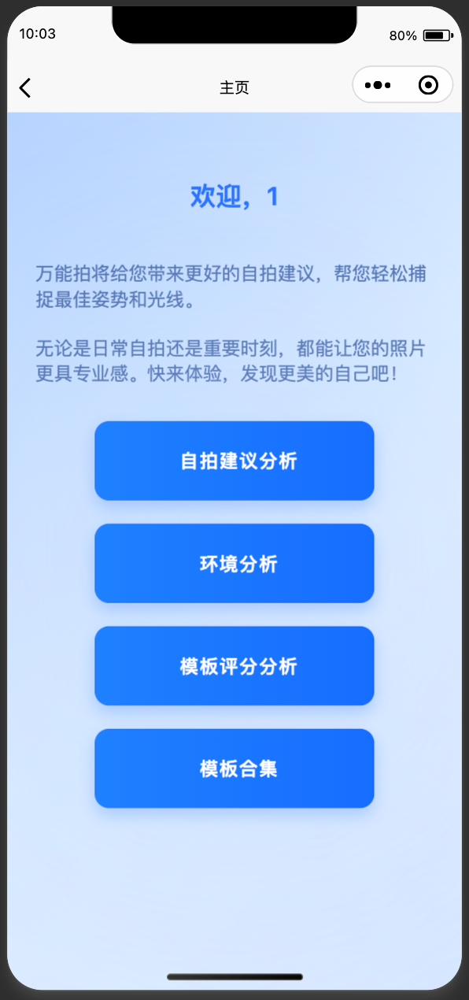
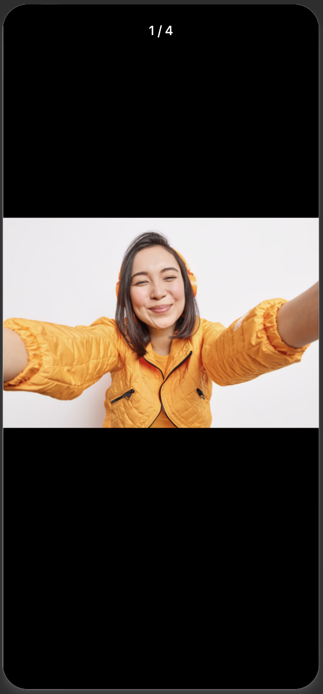
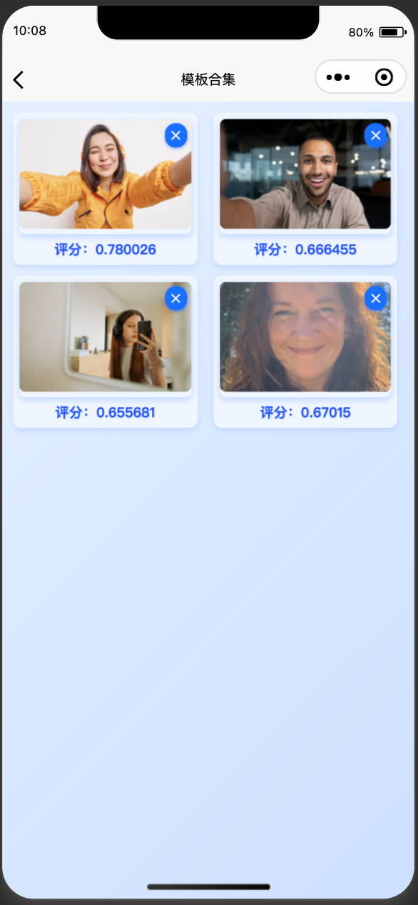
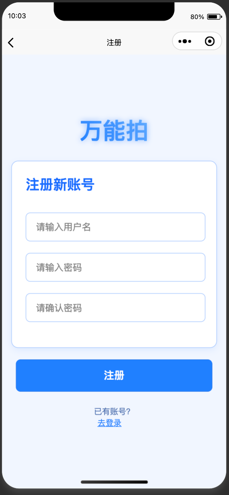
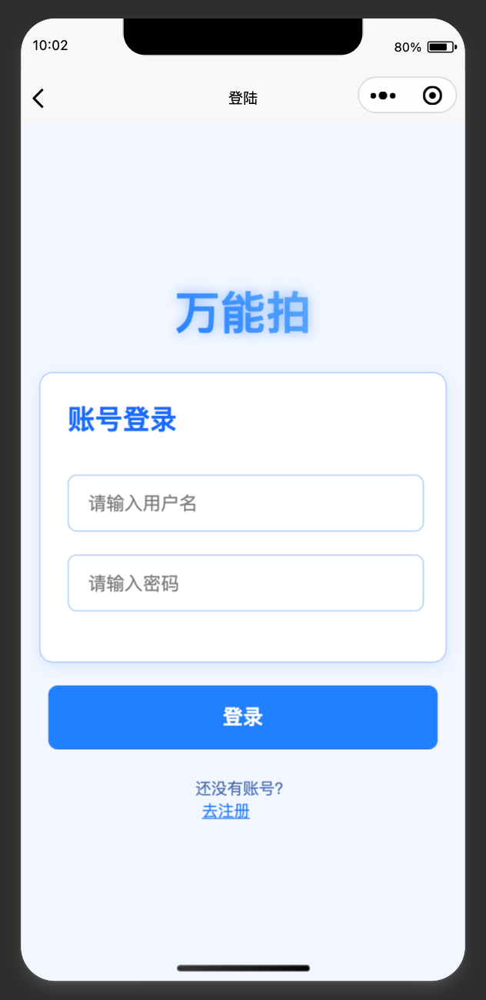
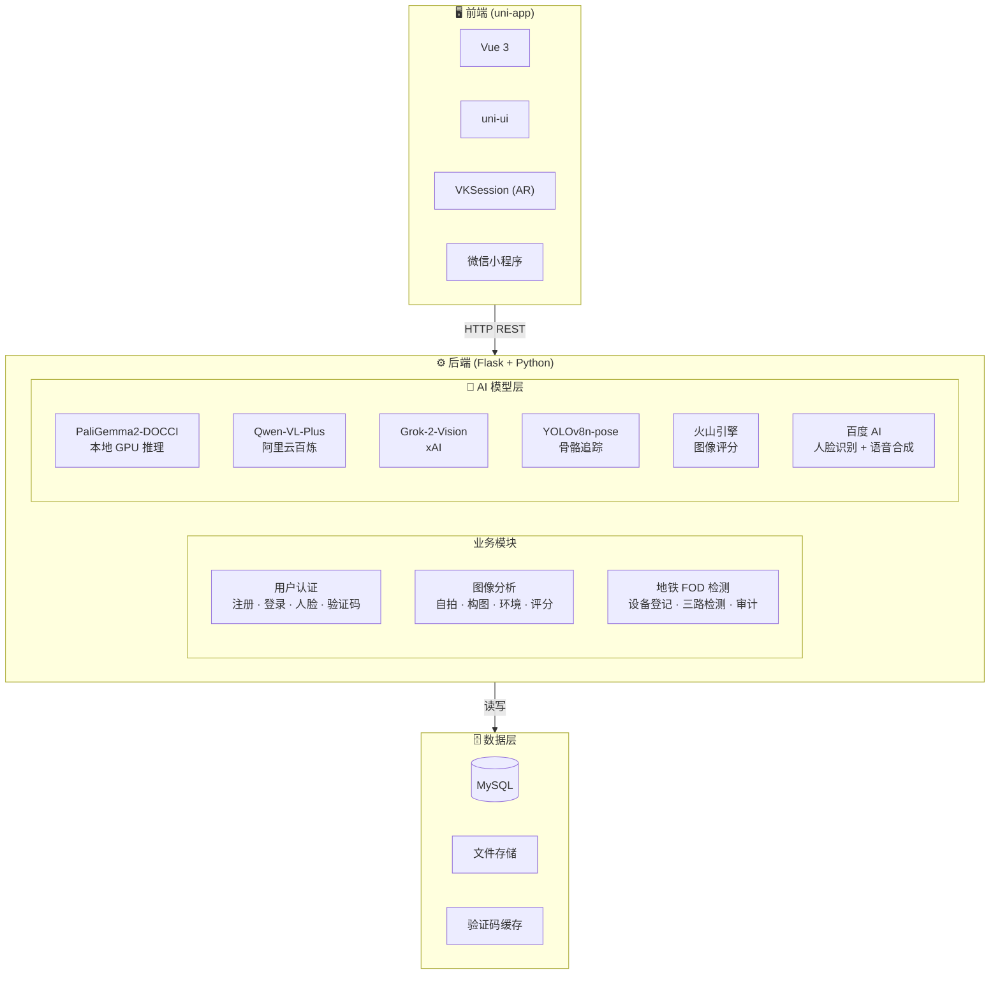
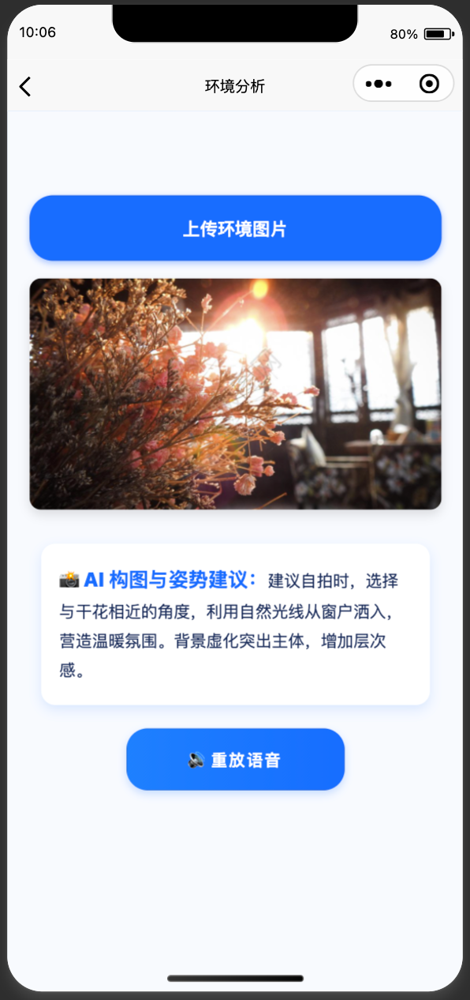
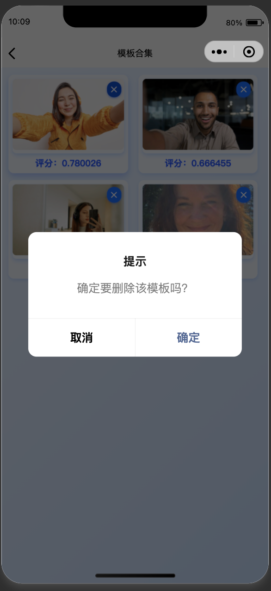
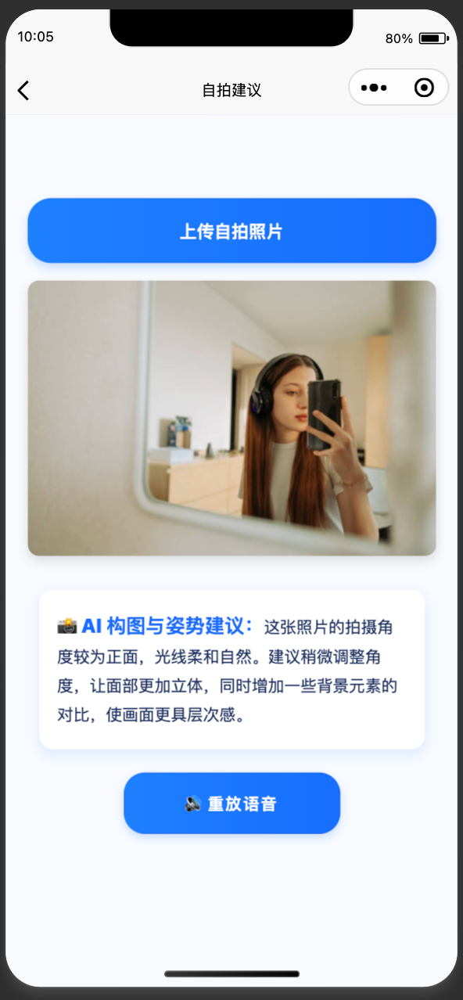
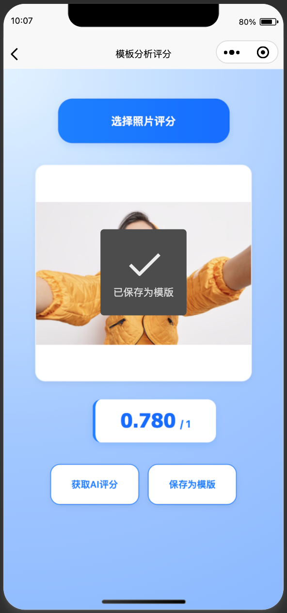

# 📸 CZCamera — AI 智能拍摄助手

> 基于多模态大模型的智能摄影辅助小程序，集自拍分析、智能构图、骨骼追踪、环境优化、人脸识别于一体，附带地铁转辙机 FOD 检测专业模块。

---

## ✨ 核心功能

### 🤳 智能自拍分析
上传自拍照片，AI（Qwen-VL-Plus / Grok-2-Vision）即时给出构图、姿势、角度等方面的改进建议，支持语音合成播报。



### 🎯 智能构图测距
结合手机传感器数据（倾斜角、俯仰角），AI 实时分析画面主体占比，给出精准的「靠近/远离/抬高/左移」语音级指令，支持**人像 / 静物 / 风景**三种模式。



### 🔬 专业模式（三阶段流水线）
```
Stage 1: PaliGemma2-DOCCI (本地 GPU)  →  密集场景描述
Stage 2: Qwen-VL-Plus (云端)           →  精确拍摄方案 JSON
Stage 3: 前端 VKSession                 →  实时骨骼关键点比对
```
输出包含 17 点骨骼关键点坐标、姿态指令、语音引导、旋转纠正、距离建议、光照评价。


### 🦴 骨骼追踪
YOLOv8n-pose 实时检测人体 17 个关键点（COCO 格式），返回归一化坐标与置信度，用于专业模式的关键点比对与实时 AR 引导。

### 🎨 线稿生成
上传照片一键生成透明背景的素描线稿，基于 OpenCV 图像处理算法（高斯模糊 + 颜色减淡）。

### 🌍 环境分析
AI 分析拍摄环境的光线、背景、构图，给出具体可执行的改善建议，同样支持语音合成。



### 📊 模板评分
对接火山引擎视觉智能服务，对上传照片进行美学评分，支持保存为模板、模板合集浏览与管理。



### 👤 人脸识别登录
基于百度 AI 人脸识别，支持人脸注册、人脸登录、人脸更新，无需记忆密码即可快速登录。

### 🚇 地铁模式 · FOD 遗留物检测
面向轨道交通场景的专业模块，用于检测转辙机内部遗留物（工具、零件等）：
- **三路并联检测**：YOLO 闭集检测 + 基准差分 + 异常兜底
- **红黄绿三级结论**：fail-safe 安全闸门，宁可误报不可漏报
- **全链路可追溯**：检测记录落库，证据可审计



---

## 🏗️ 技术架构



---

## 🚀 快速开始

### 环境要求

| 组件 | 版本要求 |
|------|---------|
| Python | ≥ 3.10 |
| Node.js | ≥ 16 |
| CUDA (可选) | ≥ 11.8（GPU 推理需要） |
| MySQL | ≥ 5.7 |
| HBuilderX | 最新版（小程序开发工具） |

### 1. 克隆项目

```bash
git clone https://github.com/Begapunk/AI_Camera_improve.git
cd AI_Camera_improve
```

### 2. 后端部署

```bash
cd universal_snap_backend

# 创建虚拟环境
python -m venv .venv
source .venv/bin/activate   # Windows: .venv\Scripts\activate

# 安装依赖
pip install -r requirements.txt

# 配置环境变量
cp .env.example .env
# 编辑 .env 填写各平台 API Key

# 初始化数据库
mysql -u root -p < init_db.sql

# 启动后端服务
python app.py
```

### 3. 前端部署

```bash
cd universal_snap_vue3/universal_snap_vue3

# 安装依赖
npm install

# 使用 HBuilderX 打开项目，配置小程序 AppID
# 在 HBuilderX 中运行 → 微信小程序
```

### 4. 模型准备（可选）

- **PaliGemma2-DOCCI**：将模型放置于 `paligemma2-3b-ft-docci-448/` 目录，或在 `.env` 中配置 `PALIGEMMA_MODEL_PATH`
- **YOLOv8n-pose**：首次运行自动下载（约 6MB）

---

## 📁 项目结构

```
AI_Camera_improve/
├── universal_snap_vue3/         # 前端 uni-app 项目
│   └── universal_snap_vue3/
│       ├── pages/               # 页面模块
│       │   ├── login/           # 登录 & 注册
│       │   ├── home/            # 主页
│       │   ├── camera/          # 智能拍摄
│       │   ├── analyze/         # 自拍分析
│       │   ├── environment/     # 环境分析
│       │   ├── template/        # 模板评分
│       │   ├── metro/           # 地铁 FOD 检测
│       │   ├── profile/         # 个人中心
│       │   └── ar/              # AR 实时引导
│       ├── static/              # 静态资源
│       └── utils/               # 工具函数
│
├── universal_snap_backend/      # 后端 Flask 项目
│   ├── app.py                   # 主应用入口 & API 路由
│   ├── Face_ID.py               # 人脸识别封装
│   ├── face_local.py            # 本地人脸识别
│   ├── config.py / settings.py  # 配置管理
│   ├── db/                      # 数据库操作
│   │   ├── db.py                # 用户 & 照片分析
│   │   └── metro_db.py          # 地铁检测记录
│   ├── metro/                   # 地铁 FOD 检测核心
│   ├── security/                # 密码安全校验
│   ├── uploads/                 # 上传文件存储
│   └── static/audio/            # 语音合成文件
│
├── paligemma2-3b-ft-docci-448/  # PaliGemma 本地模型
├── docs/images/                 # 截图 & 文档图片
├── modeltest.py                 # 模型测试脚本
└── replacements.txt             # 文本替换配置
```

---

## 🔌 核心 API 一览

| 端点 | 方法 | 说明 |
|------|------|------|
| `/api/captcha` | GET | 获取数学验证码 |
| `/register` | POST | 用户注册（含人脸） |
| `/login` | POST | 密码登录 |
| `/login-face` | POST | 人脸登录 |
| `/analyze` | POST | 自拍分析（Qwen-VL） |
| `/analyze-grok` | POST | 自拍分析（Grok） |
| `/smart-analyze` | POST | 智能构图测距 |
| `/pro-analyze` | POST | 专业模式三段流水线 |
| `/detect-pose` | POST | YOLOv8 骨骼关键点检测 |
| `/generate-sketch` | POST | 线稿生成 |
| `/analyze-env` | POST | 环境分析 |
| `/analyze-template` | POST | 图像美学评分 |
| `/api/templates` | GET | 模板列表 |
| `/metro/detect` | POST | 地铁 FOD 检测 |
| `/metro/devices/register` | POST | 转辙机设备登记 |

---

## ⚙️ 环境变量配置

在 `universal_snap_backend/.env` 中配置以下变量：

```env
# 百度 AI（人脸识别 + 语音合成）
BAIDU_APP_ID=your_app_id
BAIDU_API_KEY=your_api_key
BAIDU_SECRET_KEY=your_secret_key

# 阿里云百炼（Qwen-VL-Plus）
ALIYUN_API_KEY=your_api_key
ALIYUN_BASE_URL=https://dashscope.aliyuncs.com/compatible-mode/v1

# 火山引擎（图像评分）
VOLC_IA_AK=your_access_key
VOLC_IA_SK=your_secret_key

# xAI Grok（可选）
GROK_API_KEY=your_grok_key

# PaliGemma 本地模型路径
PALIGEMMA_MODEL_PATH=paligemma2-3b-ft-docci-448

# MySQL 数据库
DB_HOST=localhost
DB_USER=root
DB_PASSWORD=your_password
DB_NAME=snap_db
DB_PORT=3306
```

---

## 🖼️ 功能预览

| 登录 | 注册 | 首页 |
|------|------|------|
|  |  |  |

| 智能拍摄 | 自拍分析 | 环境分析 |
|----------|----------|----------|
|  |  |  |

| 模板评分 | 个人中心 | 地铁模式 |
|----------|----------|----------|
|  |  |  |

---

## 📄 License

MIT License — 详见 [LICENSE](LICENSE) 文件。

---

> 💡 **提示**：本项目为微信小程序，需配合 HBuilderX 开发工具使用。后端依赖多个第三方 AI 服务，请确保各平台 API Key 已正确配置。
